# Multi-Agent Platform Monitoring Solution — Architecture Documentation

> Source: Adobe Scan, 25 Mar 2026
> Subject: Memory architecture, agent orchestration, and data flow design for the Platform Monitoring Agent solution

---

## Table of Contents

1. [Memory Layer Execution Priority & Objectives](#1-memory-layer-execution-priority--objectives)
2. [System Architecture](#2-system-architecture)
   - [View 1: System Context (High-Level)](#view-1-system-context-high-level)
   - [View 2: Component Architecture (Detailed)](#view-2-component-architecture-detailed)
   - [View 3: Data Flow — Investigation Lifecycle](#view-3-data-flow--investigation-lifecycle)
3. [Memory Architecture — 7 Layers](#3-memory-architecture--7-layers)
   - [Layer 1: Hot Operational Buffer](#layer-1--hot-operational-buffer-real-time-state)
   - [Layer 2: Component Knowledge Graph](#layer-2--component-knowledge-graph-structural-memory)
   - [Layer 3: Incident Memory](#layer-3--incident-memory-episodic-memory)
   - [Layer 4: Domain Knowledge Store](#layer-4--domain-knowledge-store-semantic-memory)
   - [Layer 5: Release Context Memory](#layer-5--release-context-memory-temporalchange-memory)
   - [Layer 6: Session / Investigation Memory](#layer-6--session--investigation-memory-working-memory)
   - [Layer 7: Resolution Playbook Store](#layer-7--resolution-playbook-store-procedural-memory)
4. [Cross-Layer Data Flow During Triage](#4-cross-layer-data-flow-during-triage)
5. [Design Decision Summary](#5-design-decision-summary)
6. [Memory Storage Models — Comparison](#6-memory-storage-models--comparison)
7. [Agent Orchestration Design](#7-agent-orchestration-design)
   - [Agent Topology Overview](#agent-topology-overview)
   - [Monitor Agent](#monitor-agent)
   - [Triage Agent](#triage-agent)
   - [Resolution Agent](#resolution-agent)
8. [Framework Recommendation: LangGraph](#8-framework-recommendation-langgraph)
9. [Concurrent Investigation Coordination](#9-concurrent-investigation-coordination)
10. [Two-Stage User Request Deduplication](#10-two-stage-user-request-deduplication)

---

## 1. Memory Layer Execution Priority & Objectives

### Priority Order of Execution Across Memory Layers

The agents query memory layers in the following priority order:

1. **Runbook / Recipes (Layer 7)** & **Session memory (Layer 6)** — first checked
2. **Incident memory (Layer 3)**
3. **Component knowledge graph (Layer 2)** — helps agents map an issue to components
4. **Hot operational buffer (Layer 1)**
5. **Release context memory (Layer 5)**
6. **Domain knowledge store (Layer 4)**

### Objectives

- **One investigation at a time** in case of an issue
  - **User-triggered** — investigation starts from a user report
  - **Pre-emptive** — triggered when infra metrics provide a smoking gun OR a health-check detects an issue
- **Periodic health check** — is the environment healthy?
  - Health-check API
  - Key APIs latency metrics (time to load a page) — sourced from LGTM
- **Predict capacity trend** (on demand)

---

## 2. System Architecture

### View 1: System Context (High-Level)

Shows the solution boundary, external systems, and user touchpoints.

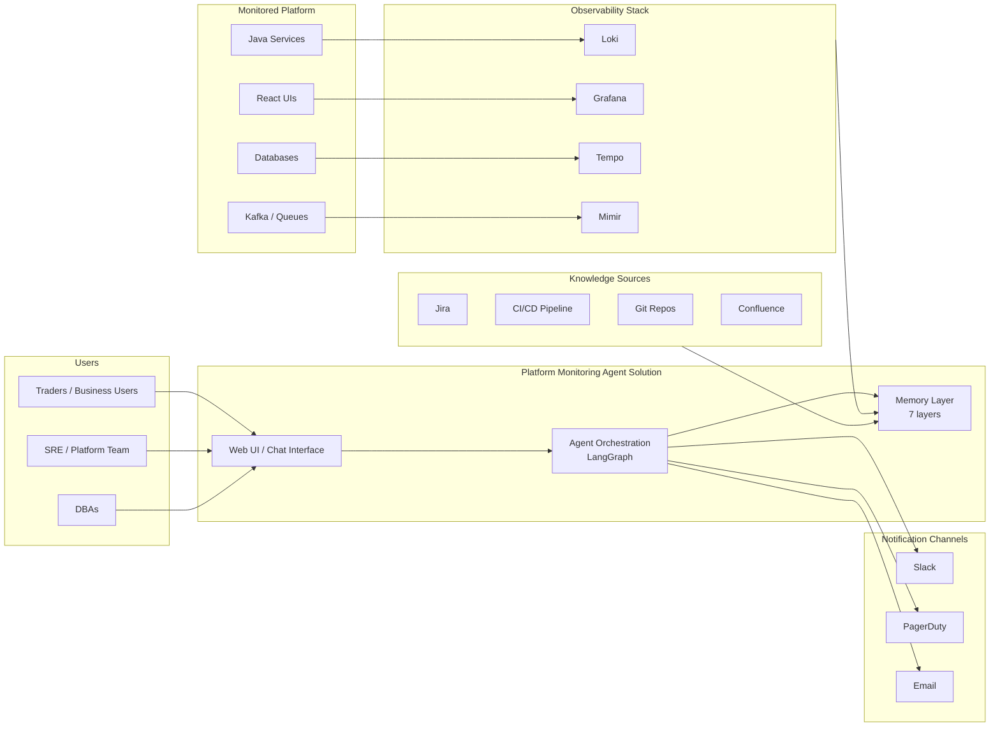

### View 2: Component Architecture (Detailed)

Shows all agents, memory layers, and their interconnections.

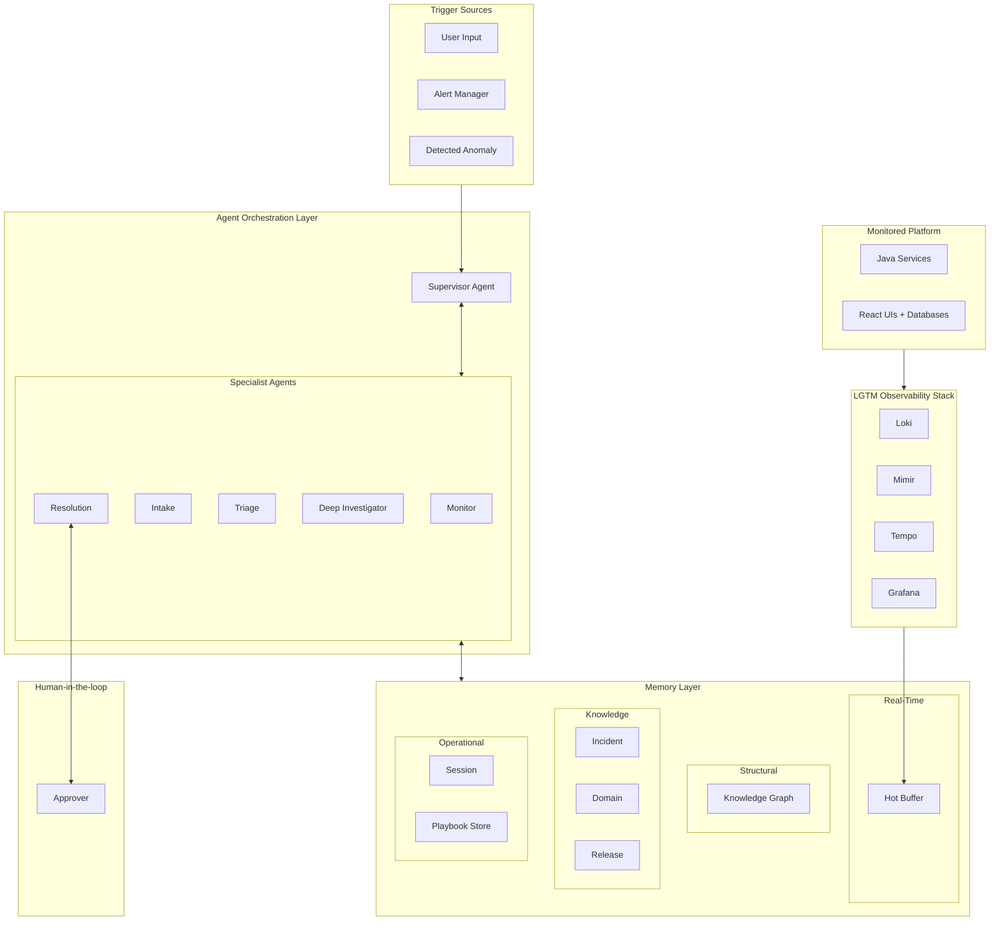

### View 3: Data Flow — Investigation Lifecycle

Shows how data moves through the system during a complete investigation, organized into four phases.

#### Phase 1 — Intake & Dedup
- **User A** reports issue → **Intake Agent** checks Session memory, queries Knowledge Graph, creates investigation
- **User B** reports the same issue → **Intake Agent** dedups via Session memory and notifies User B

#### Phase 2 — Triage
- Route to **Triage Agent**
- Query **Hot Buffer**, **Releases**, **Incident Memory**
- Updates hypothesis in **Session memory**
- Route to **Resolution Agent**

#### Phase 3 — Resolution
- **Resolution Agent** finds applicable Playbook
- Executes low-risk queries automatically (e.g., return data automatic)
- Proposes high-risk action (e.g., `CREATE INDEX`) → **Human Approver** approves → executes action → returns confirmation
- Verifies fix on Hot Buffer

#### Phase 4 — Close & Notify
- Archives investigation to **Incident Memory**
- Notifies User A and User B

---

## 3. Memory Architecture — 7 Layers

### High-Level Memory Layers Overview

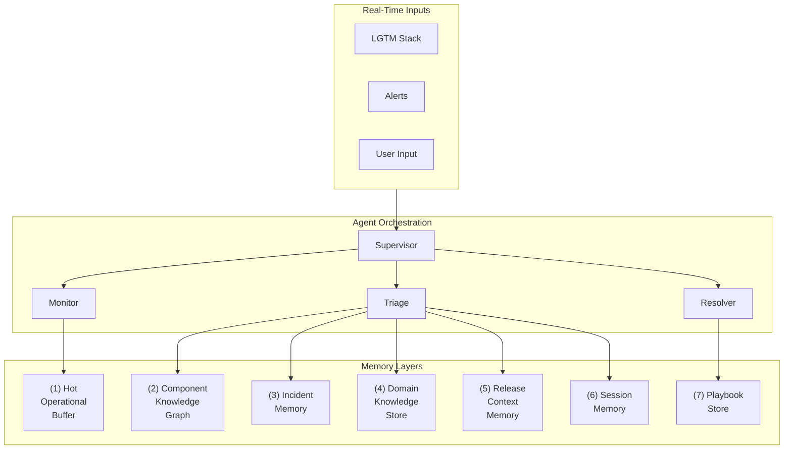

---

### Layer 1 — Hot Operational Buffer (Real-Time State)

**Purpose:** Hold the live, most recent operational snapshot of the platform. This is what the Monitor Agent reads continuously to detect anomalies.

| Attribute | Detail |
|---|---|
| **Data** | Last N minutes of: error rates, latency P50/P95/P99, active alerts, health check statuses, recent log error signatures, trace anomalies |
| **Granularity** | Per-component (all 150+ services), updated every 15–60 seconds |
| **Retention** | Rolling window: 15 min high-res, 1 hour downsampled, 24 hours for alert state |
| **Technology** | Redis (?) backed by LGTM's native APIs |
| **Access Pattern** | Write-heavy streaming ingest; read by Monitor Agent on tight polling loops |

**Why this layer exists (Accuracy + Performance):**
- Anomaly detection needs *current* data, not yesterday's summaries
- Sub-second reads are critical — you can't wait for a vector DB query to know if a service is down
- Pre-aggregated metrics avoid expensive ad-hoc Mimir queries during incidents

**Data Schema (conceptual):**

```
component:{service-name}:health   → { status, last_check_ts, error_rate_1m, latency_p... }
component:{service-name}:alerts   → [ { alert_id, severity, message, fired_at } ]
component:{service-name}:log_errors → [ { signature_hash, count_5m, sample_message } ]
```

> [!IMPORTANT]
> This layer is **not** a replacement for the LGTM stack. It is a **pre-computed, agent-optimized view** of LGTM data — a cache designed for agent consumption patterns.

---

### Layer 2 — Component Knowledge Graph (Structural Memory)

**Purpose:** Encode the architecture of the platform — what components exist, how they relate, what business functions they serve, and who owns them. This is the layer that maps "margin calculation is slow" to specific Java services.

| Attribute | Detail |
|---|---|
| **Data** | Components, dependencies, APIs, business functions, ownership, infrastructure topology |
| **Retention** | Persistent, versioned (updated with release notes and architecture changes) |
| **Technology** | Neo4j with a semantic search sidecar |
| **Access Pattern** | Read-heavy; infrequent writes (on release or architecture change) |
| **Maintenance** | **Hybrid**: Initial topology seeded manually by platform team; continuously enriched via auto-inference from service mesh, API gateway configs, deployment manifests, and CI/CD pipeline metadata. Agents flag detected drift for human review. |

#### Graph Model

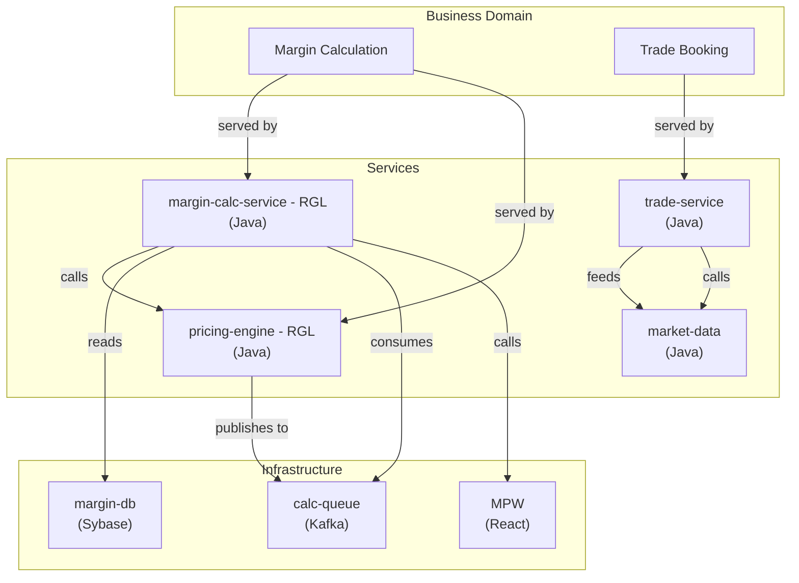

#### Key Node Types and Properties

| Node Type | Key Properties |
|---|---|
| **BusinessFunction** | `name`, `description`, `SLA`, `criticality` |
| **Service** | `name`, `language`, `repo`, `team`, `deploy_env`, `health_endpoint` |
| **Database** | `name`, `engine`, `connection_string`, `component` |
| **Queue** | `name`, `technology`, `topics` |
| **UIApp** | `name`, `framework`, `URL`, `depends_on` |
| **Team** | `name`, `slack_channel`, `on_call_rotation` |

#### Key Edge Types

| Edge | Meaning |
|---|---|
| `SERVES` | Business function → Services that implement it |
| `CALLS` / `DEPENDS_ON` | Service → Service or Service → Infra dependency |
| `OWNED_BY` | Component → Team |
| `READS` / `WRITES` | Service → Database |
| `PUBLISHES` / `CONSUMES` | Service → Queue |

> [!TIP]
> **Functional-to-technical mapping is the most critical capability of this layer.** When a user says "margin calculation is slow," the Intake Agent does:
> ```cypher
> MATCH (bf:BusinessFunction {name: "Margin Calculation"})-[:SERVES]-(s:Service) RETURN s
> ```
> plus a 2-hop dependency traversal to get the full blast radius.

---

### Layer 3 — Incident Memory (Episodic Memory)

**Purpose:** Store past incidents with full context — what happened, what symptoms appeared, what the root cause was, and how it was resolved. This is the primary learning engine.

| Attribute | Detail |
|---|---|
| **Data** | Structured incident records + embedded vector representations |
| **Retention** | Permanent (historical incidents are always valuable) |
| **Technology** | PostgreSQL (structured fields) + pgvector (semantic embeddings) |
| **Access Pattern** | Write on incident close; read during triage (semantic similarity search) |
| **Bootstrapping** | Seeded from existing incident history (ServiceNow, Teams chat, etc.). An ingestion pipeline normalizes records into the schema below and generates embeddings. Post-bootstrap, agents continuously update this layer — every closed investigation (L6 → L3 archival) creates a new incident record automatically. |

#### Incident Record Schema

```json
{
  "incident_id": "INC-2025-4821",
  "title": "Margin calculation latency spike after Q4 release",
  "created_at": "2025-12-15T14:22:00Z",
  "resolved_at": "2025-12-15T16:45:00Z",
  "severity": "P1",
  "symptoms": [
    "margin-calc-service P99 latency > 5s",
    "Kafka consumer lag on calc-queue > 50k",
    "trading-ui timeout errors on /api/margin"
  ],
  "affected_components": ["margin-calc-service", "calc-queue", "pricing-engine"],
  "affected_business_functions": ["Margin Calculation"],
  "root_cause": "N+1 query in margin-calc-service after ORM upgrade in release v3...",
  "resolution": "Reverted ORM change, added batch query, deployed hotfix v3.12.1",
  "resolution_steps": [ "..." ]
}
```

#### Retrieval Strategy During Triage

1. **Symptom-based vector search:** Embed the current symptom set → find top-K similar past incidents
2. **Component-based filter:** Narrow results to incidents involving the same components
3. **Recency boost:** Weight recent incidents higher (the platform evolves)

> [!IMPORTANT]
> The embedding is generated from a concatenation of `symptoms + root_cause + resolution` — not just the title. This ensures that structurally similar problems surface even if they are described differently.

---

### Layer 4 — Domain Knowledge Store (Semantic Memory)

**Purpose:** Store business and technical specifications, architectural documentation, and component-level documentation in a searchable form. This is the agent's "understanding" of how things work.

| Attribute | Detail |
|---|---|
| **Data** | Business specs, technical specs, API docs, architecture docs, runbooks, SOPs |
| **Retention** | Persistent, versioned |
| **Technology** | Vector DB with chunked document embeddings |
| **Access Pattern** | Read during triage and resolution; write on doc ingestion |

#### Document Ingestion Pipeline

```
Source Docs → Chunking (by section/heading) → Enrichment (tag with components,
business functions via L2 graph) → Embedding → Store in Vector DB
```

**Why enrichment matters (Accuracy):** Raw vector search on "margin calculation slow" might surface unrelated documents about margins in CSS. By tagging each chunk with the components and business functions it relates to (using the Knowledge Graph in Layer 2), the Triage Agent can do **filtered semantic search**:

```python
query: "margin calculation slow"
filters: { business_function: "Margin Calculation" }  # resolved via L2
```

This dramatically improves retrieval precision, which is the #1 priority (accuracy).

---

### Layer 5 — Release Context Memory (Temporal/Change Memory)

**Purpose:** Track what changed and when. Most incidents are caused by changes — releases, config updates, infra changes. This layer enables the critical question: **"What changed recently?"**

| Attribute | Detail |
|---|---|
| **Data** | Release notes, deployment events, config changes, dependency upgrades |
| **Retention** | 12 months high-detail, older releases summarized |
| **Technology** | Relational DB (structured) + vector embeddings of release notes |
| **Access Pattern** | Read during triage; write on deployment events |

#### Schema

```json
{
  "release_id": "v3.12.0",
  "deployed_at": "2025-12-15T10:00:00Z",
  "components_changed": ["margin-calc-service", "pricing-engine"],
  "change_summary": "Upgraded Hibernate ORM to 6.x, refactored margin query layer",
  "detailed_changes": [ "..." ],
  "jira_tickets": ["PLAT-4521", "PLAT-4530"],
  "risk_tags": ["orm-upgrade", "query-change", "breaking-change"],
  "embedding": [0.045, -0.092, ...]
}
```

#### Triage Integration

When the Triage Agent detects an issue on `margin-calc-service`, it automatically queries:

```sql
SELECT * FROM releases
WHERE 'margin-calc-service' = ANY(components_changed)
  AND deployed_at > NOW() - INTERVAL '48 hours'
ORDER BY deployed_at DESC;
```

> [!TIP]
> Correlating incidents with recent changes is one of the highest-signal triage heuristics. This layer makes that correlation instant and reliable.

---

### Layer 6 — Session / Investigation Memory (Working Memory)

**Purpose:** Track the state of an *active* investigation or incident. This is the scratchpad where agents record what they've checked, what they've found, and what hypotheses they're pursuing.

| Attribute | Detail |
|---|---|
| **Data** | Current investigation context: hypotheses, evidence collected, checks performed, agent reasoning chain |
| **Retention** | Duration of the active investigation; archived to Incident Memory (L3) on close |
| **Technology** | Redis or in-memory (ephemeral) — structured JSON documents |
| **Access Pattern** | High-frequency read/write by all agents during an active investigation |

#### Investigation State Document

```json
{
  "investigation_id": "INV-20260312-001",
  "trigger": "user_report: 'margin calculation is running slow'",
  "status": "investigating",
  "mapped_business_function": "Margin Calculation",
  "mapped_components": ["margin-calc-service", "pricing-engine", "calc-queue", "ma..."],
  "hypotheses": [
    {
      "id": "H1",
      "description": "Database query degradation on margin-db",
      "confidence": 0.7,
      "evidence": ["margin-db CPU at 89%", "slow query log shows 3 queries > 2s"],
      "status": "investigating"
    },
    {
      "id": "H2",
      "description": "Kafka consumer lag causing delayed processing",
      "confidence": 0.3,
      ...
    }
  ]
}
```

This layer also handles **multi-user deduplication** — maintains a coherent narrative across multiple agent handoffs. The structured hypothesis format forces systematic investigation, not random probing.

---

### Layer 7 — Resolution Playbook Store (Procedural Memory)

**Purpose:** Store proven, reusable resolution procedures — runbooks, automated remediation scripts, and escalation paths. This is what the Resolution Agent draws from to *fix* problems.

| Attribute | Detail |
|---|---|
| **Data** | Step-by-step runbooks, automated scripts, escalation trees, rollback procedures |
| **Retention** | Persistent, versioned |
| **Technology** | Git-backed markdown + PostgreSQL index with vector embeddings |
| **Access Pattern** | Read by Resolution Agent; authored/updated by SRE teams |

#### Risk-Rated Action Model

Every action step carries a **risk rating** that determines execution policy:

| Risk Level | Execution Policy | Examples |
|---|---|---|
| 🟢 **Low** | Agent auto-executes | Query `pg_stat_statements`, check logs, read metrics, describe resources |
| 🟡 **Medium** | Agent auto-executes with notification | Restart a non-critical consumer, scale up replicas, clear cache |
| 🔴 **High** | Requires human approval before execution | Rollback a release, modify DB schema, kill active sessions, change routing |

#### Environment-Specific Permissions

Risk ratings are **environment-aware** — the same action can have different risk levels in staging vs. production. (e.g., a schema modification might be Low in staging but High in production.)

---

## 4. Cross-Layer Data Flow During Triage

How the layers interact when a user reports **"margin calculation is running slow"**:

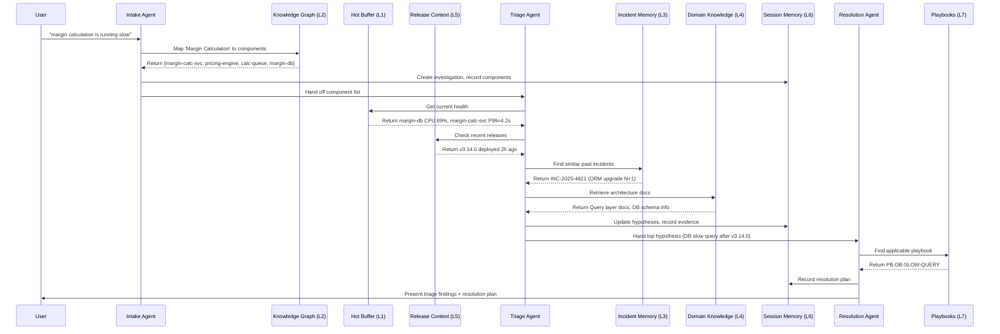

---

## 5. Design Decision Summary

| Decision | Rationale (Priority Alignment) |
|---|---|
| Dedicated Knowledge Graph (L2) for functional → technical mapping | **Accuracy:** Graph traversal gives deterministic, precise mappings instead of relying solely on fuzzy embedding matches |
| Symptom-embedded incident search (L3) with component filtering | **Accuracy:** Dual retrieval (vector + structured filter) eliminates irrelevant matches |
| Hot Buffer (L1) instead of direct LGTM queries | **Performance:** Sub-millisecond reads vs. seconds for ad-hoc Mimir queries |
| Filtered semantic search in L4 (component-tagged chunks) | **Accuracy:** Improves retrieval precision dramatically by leveraging L2 graph |
| Release Context Memory (L5) as a first-class layer | **Accuracy:** Recent-change correlation is one of the strongest triage heuristics |
| Session Memory (L6) → Incident Memory (L3) archival | **Continuous learning:** Every closed investigation grows the knowledge base |
| Risk-rated actions in L7 with environment-aware permissions | **Safety:** Prevents agents from auto-executing dangerous actions in production |

---

## 6. Memory Storage Models — Comparison

### The Structured Knowledge Graph Model

Memory is stored as **entities and relationships** in a graph, not as raw text.

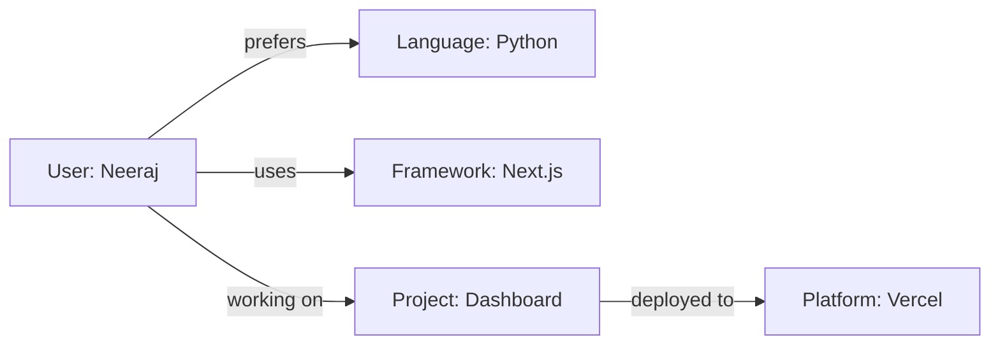

**Pros:**
- Highly precise, structured recall (no ambiguity)
- Supports relational queries ("What frameworks does Neeraj's project use?")
- Compact storage — no redundant prose

**Cons:**
- Hard to build automatically from unstructured conversation
- Loses nuance, context, and reasoning (only stores facts)
- Entity resolution is error-prone ("the app" vs. "Dashboard" vs. "the project")
- Difficult to maintain as knowledge evolves

> [!NOTE]
> Used by: Mem0, some enterprise AI platforms, Zep

### The Scratchpad / Notebook Model

The agent explicitly writes and reads from structured files (like notes, plans, or task lists) that it manages itself.

| File | Purpose |
|---|---|
| `task.md` | Current checklist of work |
| `implementation_plan.md` | Design decisions |
| `notes.md` | Key facts and preferences learned |

**Pros:**
- Fully transparent and inspectable by the user
- Agent has explicit control over what to remember
- Easy to edit, version, and persist
- No embedding/retrieval failures — it's just files

---

## 7. Agent Orchestration Design

### Agent Topology Overview

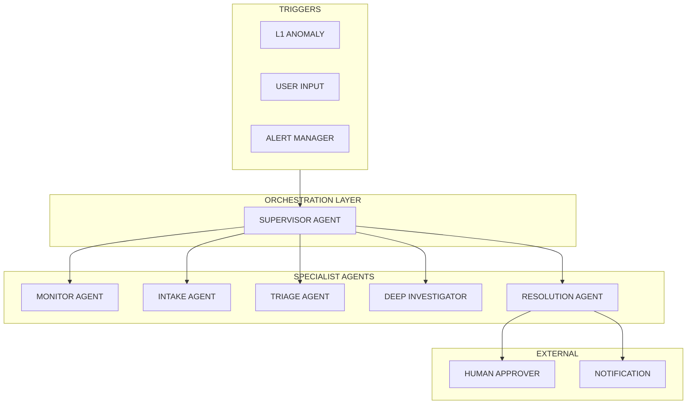

### Agent Responsibilities

#### 🟣 Supervisor Agent

The central orchestrator. It does **not** investigate or resolve — it **routes, tracks, and decides**.

#### Monitor Agent

The only **always-on** agent. Runs as a background loop, not triggered by conversations.

| Attribute | Detail |
|---|---|
| **Role** | Continuous anomaly detection on platform health |
| **Runs** | Perpetual loop (15–60 second intervals) |
| **LLM calls** | None in the hot path — rule-based + statistical anomaly detection |
| **Memory** | Reads Layer 1 (Hot Buffer), writes anomaly events to Supervisor |

**Detection Pipeline:**

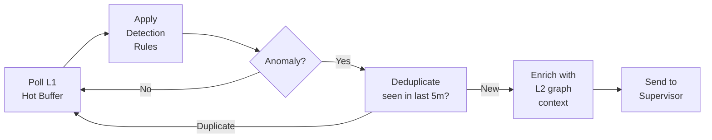

**Detection strategies (no LLM needed):**
- Rule-based threshold checks (e.g., latency P99 > 5s)
- Statistical anomaly detection (e.g., 3-sigma deviation from baseline)
- Pattern matching on log signatures

### Triage Agent

#### Available Tools

| Tool | Purpose |
|---|---|
| `query_logs` | Execute LogQL queries against Loki (ad-hoc, when L1 isn't sufficient) |
| `query_metrics` | Execute PromQL queries against Mimir |
| `query_traces` | Execute TraceQL queries against Tempo |
| `update_investigation` | Write evidence and hypotheses to L6 |

#### Triage Investigation Loop

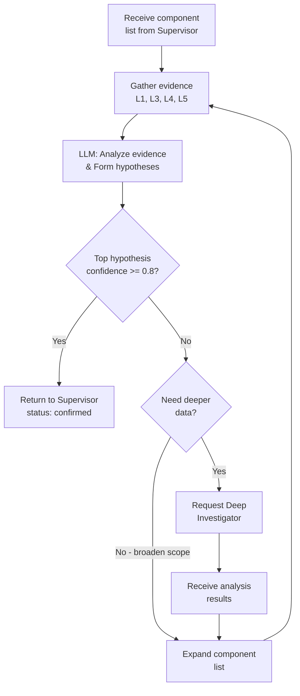

#### Hypothesis Schema (written to L6 after each iteration)

```json
{
  "id": "H1",
  "description": "Missing index on positions table after v4.7.0 migration",
  "confidence": 0.92,
  "category": "database_performance",
  "affected_component": "position-db",
  "causal_chain": [
    "v4.7.0 added account_region column",
    "..."
  ]
}
```

### Resolution Agent

#### Approval Flow State Machine

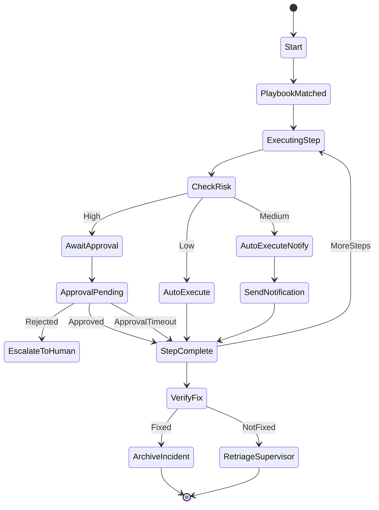

The Resolution Agent also calls `notify_team` to send Slack/PagerDuty notifications.

---

## 8. Framework Recommendation: LangGraph

### Comparison

| Criteria | **LangGraph** | CrewAI | Custom (FastAPI + Celery) |
|---|---|---|---|
| **Stateful cyclic graphs** | ✅ Native | ❌ Linear pipelines | ✅ Manual |
| **Human-in-the-loop** | ✅ Built-in `interrupt()` | ⚠️ Bolted on | ✅ Manual |

### LangGraph Architecture

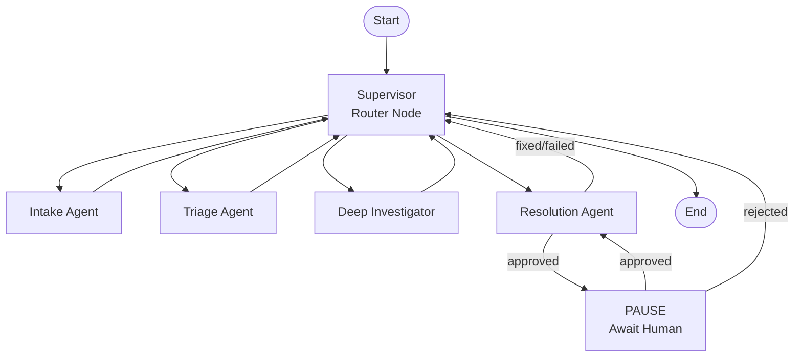

### Implementation Structure

```python
from langgraph.graph import StateGraph, START, END
from langgraph.checkpoint.postgres import PostgresSaver

# Shared investigation state (persisted in checkpoint)
class InvestigationState(TypedDict):
    investigation_id: str
    environment: str                       # "prod" | "staging"
    trigger_type: str                      # "user_input" | "anomaly" | "alert"
    user_input: Optional[str]
    trigger_embedding: list[float]         # embedding of trigger text (for dedup)
    subscribers: list[str]                 # users tracking this investigation
    mapped_components: list[str]
    health_snapshot: dict
    recent_releases: list[dict]
    similar_incidents: list[dict]
    hypotheses: list[dict]
    current_phase: str                     # routing key
    triage_iterations: int
```

---

## 9. Concurrent Investigation Coordination

### The Problem

Multiple investigations may run simultaneously:

- Monitor detects 3 anomalies within 2 minutes — are they the same root cause or independent?
- A user reports "margin calculation slow" while Monitor already opened an investigation for `position-db CPU spike`
- Two users report different symptoms of the same underlying issue

### Solution: Investigation Manager (within Supervisor)

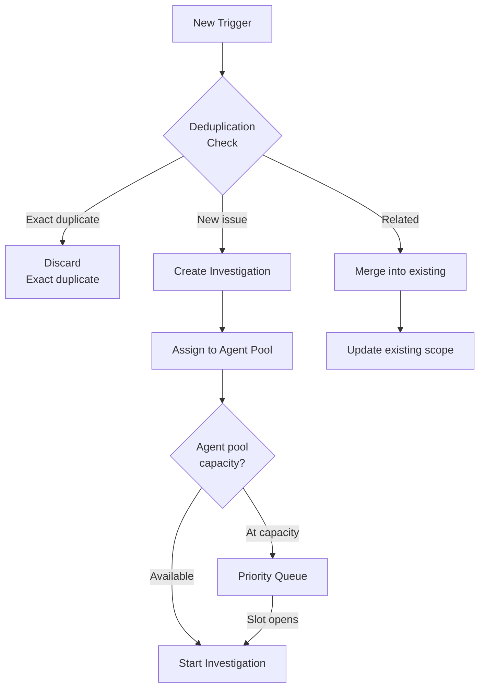

### Deduplication Logic

The basic deduplication above handles **anomaly-triggered** investigations (component overlap). But for **user-submitted requests**, the problem is harder — multiple users may describe the same issue differently.

#### User Input Deduplication Examples

| User | Input | Same issue? |
|---|---|---|
| User A | "margin calculation is slow" | ✅ First report |
| User B | "calculation slow" | ✅ Same — deduplicate |
| User C | "slow calculation" | ✅ Same — deduplicate |
| User D | "margin calc timing out on trading desk" | ✅ Same — deduplicate |
| User E | "trade booking failed" | ❌ Different issue |

---

## 10. Two-Stage User Request Deduplication

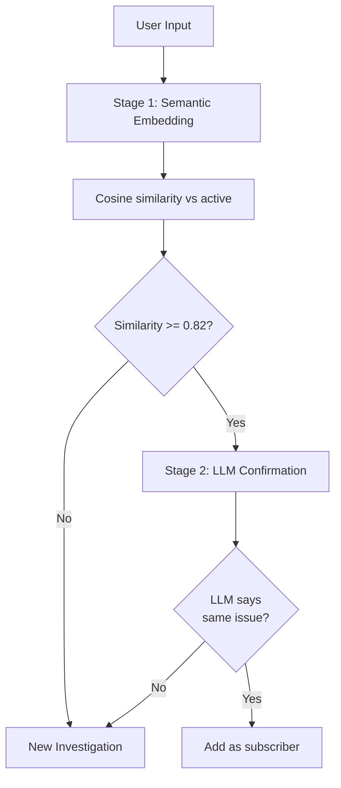

### Stage 1 — Embedding Similarity (< 50ms, no LLM cost)

```python
from sentence_transformers import SentenceTransformer

embedder = SentenceTransformer('all-MiniLM-L6-v2')  # fast, 384-dim
```

- Embed the new user input
- Compute cosine similarity vs. all active investigations' trigger embeddings
- If `similarity >= 0.82` → escalate to Stage 2
- Otherwise → treat as new investigation

### Stage 2 — LLM Confirmation

- Cheap LLM call confirms whether the two reports describe the same underlying issue
- If confirmed → user added as a subscriber to the existing investigation (not a duplicate investigation)
- If not → create a new investigation

This two-stage design keeps cost low (most requests resolve in Stage 1) while preserving accuracy (LLM catches paraphrases and ambiguous matches).

---

## Appendix — Technology Stack Summary

| Layer | Technology |
|---|---|
| L1 — Hot Buffer | Redis (?) backed by LGTM native APIs |
| L2 — Knowledge Graph | Neo4j + semantic search sidecar |
| L3 — Incident Memory | PostgreSQL + pgvector |
| L4 — Domain Knowledge | Vector DB with chunked embeddings |
| L5 — Release Context | Relational DB + vector embeddings |
| L6 — Session Memory | Redis or in-memory (ephemeral JSON) |
| L7 — Playbook Store | Git-backed markdown + PostgreSQL index with vector embeddings |
| Orchestration | LangGraph + PostgresSaver checkpointing |
| Embedding model | `all-MiniLM-L6-v2` (384-dim) |
| Observability source | LGTM stack (Loki, Grafana, Tempo, Mimir) |

---

*End of document.*
